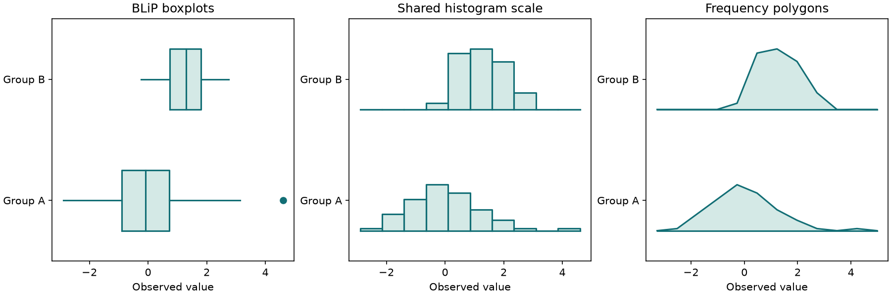

# BLiP standard distribution plots

BLiP's standard boxplots, histograms and frequency polygons are available as
plotting-independent geometry plus an optional Matplotlib renderer.

```python
from mdanderson_stats import blip_data, plot_blip

geometry = blip_data(
    [0, 1, 2, 3, 4, 5, 20],
    [0, 1, 1, 2, 3, 3, 4, 4],
    mode="histogram",
    breaks=[0, 2, 4, 10, 20],
    labels=("First group", "Second group"),
)
axes = plot_blip(geometry, count_labels=True, xlabel="Value")
axes.figure.savefig("blip-histogram.png")
```



Install the package's `plot` extra to render. `blip_data` itself does not import
Matplotlib. Pass one positional numeric vector per group, with optional labels.
NaNs are omitted and counted per group; infinity and all-missing groups are
rejected. Limits are 100 groups and one million combined nonmissing observations,
with at most one million entries in each input vector. Numerical arrays in the
returned `BLiPPlot.groups` are immutable.

## Geometry and conventions

`mode="boxplot"` uses interpolated 25th, 50th and 75th percentiles. Its whiskers
are the 1.5-IQR fences clipped to the sample minimum/maximum. They are **not**
snapped to actual observations as in many standard boxplot implementations.
The group `coordinates` contain lower whisker, Q1, median, Q3 and upper whisker;
`outliers` contain every observation beyond those endpoints, including repeats.

For `mode="histogram"` or `"polygon"`, `coordinates` contain bin edges and
`counts` contain bin frequencies. Interior bins are right-closed, and both outer
endpoints are included. This follows the source's `cut` convention, which differs
from NumPy histogram's usual left-closed interior bins. `nclass` selects 1..1000
equal-width classes; `breaks` supplies 2..1001 explicit increasing endpoints.
Breaks must cover every observation. Constant-range data require explicit breaks.

With `uniform=True`, automatic bins span all groups and heights share the largest
bin frequency across groups. With `uniform=False`, automatic bins span each group
and its own largest count sets the height. Explicit breaks are shared in either
case. Heights are counts, not probability densities, including for unequal bins.

Group i (zero-based) occupies the fraction `(i + region) / number_of_groups`,
where `region=(.25,.75)` by default. `low`/`high` delimit that region, and
`heights` contain scaled bin-top coordinates. Frequency polygons connect bin
midpoints and return to the baseline half a first-bin width beyond each end,
including the source's first-bin-width convention for unequal explicit bins.

`plot_blip` accepts an existing linear-scale `axes`, line `color`, `fill`,
`count_labels`, and `xlabel`. It returns the Axes and does not show or save it.
Use the returned Axes for further formatting. Count labels omit empty bins.
No graphical style or automatic tick-spacing parity with historical S is claimed.

## Source validation and differences

The original `blip.s` was translated mechanically from S underscore assignment
to R assignment syntax. Its `bp` and `histo` functions were executed under R,
with polygon/line/segment callbacks recording the geometry. Tests compare the
quartiles, interpolated whiskers and all histogram rectangle vertices of a
two-group example. Additional checks cover right-closed bins, missing values,
per-group scaling and canvas rendering for all three standard modes. The
three-panel example was rendered and visually inspected.

The source expands exterior cut points by an arbitrary 0.1. Python instead
includes the exact endpoints and rejects bins that omit data, avoiding silent
loss or accidental inclusion just outside the requested range. The source's
nonuniform histogram and polygon label branches refer to an undefined
`freqtext`; Python labels the calculated counts directly.

BLiP remains **partial**: its custom percentile boxes, fixed/variable widths,
percentile lines, mean/SD/SE overlays, six point patterns and associated custom
layout controls still need implementation. The standard modes here do not stand
in for those methods.

Source: [MD Anderson BLIP](https://biostatistics.mdanderson.org/SoftwareDownload/SingleSoftware/Index/36),
[archive](https://biostatistics.mdanderson.org/SoftwareDownload/SoftwareFiles/BLIP/BLIP_V1.tar.gz).
Lee, J. Jack and Tu, Z. Nora (1997), “A Versatile One-dimensional Distribution
Plot: The BLiP Plot,” The American Statistician 51:353–358. Source hashes are in
`blip-sources.json`; original usage terms are preserved in the third-party notices.
