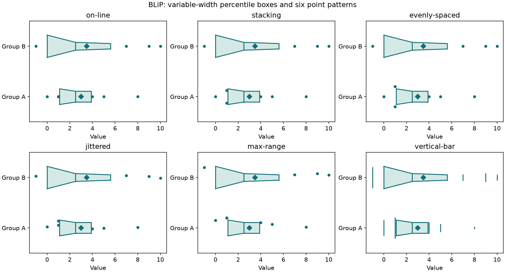

# BLiP distribution plots

BLiP's standard and custom distribution plots are available as
plotting-independent geometry plus optional Matplotlib renderers.

```python
from mdanderson_stats import blip_data, plot_blip

geometry = blip_data(
    [0, 1, 2, 3, 4, 5, 20],
    [0, 1, 1, 2, 3, 3, 4, 4],
    mode="histogram",
    breaks=[0, 2, 4, 10, 20],
    labels=("First group", "Second group"),
)
axes = plot_blip(geometry, count_labels=True, xlabel="Value")
axes.figure.savefig("blip-histogram.png")
```


Install the package's `plot` extra to render. `blip_data` itself does not import
Matplotlib. Pass one positional numeric vector per group, with optional labels.
NaNs are omitted and counted per group; infinity and all-missing groups are
rejected. Limits are 100 groups and one million combined nonmissing observations,
with at most one million entries in each input vector. Numerical arrays in the
returned `BLiPPlot.groups` are immutable.

## Geometry and conventions

`mode="boxplot"` uses interpolated 25th, 50th and 75th percentiles. Its whiskers
are the 1.5-IQR fences clipped to the sample minimum/maximum. They are **not**
snapped to actual observations as in many standard boxplot implementations.
The group `coordinates` contain lower whisker, Q1, median, Q3 and upper whisker;
`outliers` contain every observation beyond those endpoints, including repeats.

For `mode="histogram"` or `"polygon"`, `coordinates` contain bin edges and
`counts` contain bin frequencies. Interior bins are right-closed, and both outer
endpoints are included. This follows the source's `cut` convention, which differs
from NumPy histogram's usual left-closed interior bins. `nclass` selects 1..1000
equal-width classes; `breaks` supplies 2..1001 explicit increasing endpoints.
Breaks must cover every observation. Constant-range data require explicit breaks.

With `uniform=True`, automatic bins span all groups and heights share the largest
bin frequency across groups. With `uniform=False`, automatic bins span each group
and its own largest count sets the height. Explicit breaks are shared in either
case. Heights are counts, not probability densities, including for unequal bins.

Group i (zero-based) occupies the fraction `(i + region) / number_of_groups`,
where `region=(.25,.75)` by default. `low`/`high` delimit that region, and
`heights` contain scaled bin-top coordinates. Frequency polygons connect bin
midpoints and return to the baseline half a first-bin width beyond each end,
including the source's first-bin-width convention for unequal explicit bins.

`plot_blip` accepts an existing linear-scale `axes`, line `color`, `fill`,
`count_labels`, and `xlabel`. It returns the Axes and does not show or save it.
Use the returned Axes for further formatting. Count labels omit empty bins.
No graphical style or automatic tick-spacing parity with historical S is claimed.

## Source validation and differences

The original `blip.s` was translated mechanically from S underscore assignment
to R assignment syntax. Its `bp` and `histo` functions were executed under R,
with polygon/line/segment callbacks recording the geometry. Tests compare the
quartiles, interpolated whiskers and all histogram rectangle vertices of a
two-group example. Additional checks cover right-closed bins, missing values,
per-group scaling and canvas rendering for all three standard modes. The
three-panel example was rendered and visually inspected.

The source expands exterior cut points by an arbitrary 0.1. Python instead
includes the exact endpoints and rejects bins that omit data, avoiding silent
loss or accidental inclusion just outside the requested range. The source's
nonuniform histogram and polygon label branches refer to an undefined
`freqtext`; Python labels the calculated counts directly.

## Custom boxes, lines and points

```python
from mdanderson_stats import blip_custom_data, plot_blip_custom

geometry = blip_custom_data(
    [0, 1, 1, 2, 3, 4, 5, 8],
    [-1, 0, 0, 0, 2, 3, 5, 7, 9, 10],
    boxes=((0.2, 0.4), (0.6, 0.8)),
    lines=((0.4, 0.6),),
    width="variable",
    point_pattern="jittered",
    mean=True,
)
axes = plot_blip_custom(geometry, percentile_labels=True)
axes.figure.savefig("blip-custom.png")
```



`boxes` and `lines` contain separate percentile sequences; `()` disables them.
This replaces the source's zero separators. Probabilities in each piece must be
strictly increasing in [0,1]. Line pieces require at least two probabilities;
a single-probability box piece draws an isolated percentile bar, including the
source's optional minimum/maximum bars. Such isolated bars do not hide points.
Pieces may overlap deliberately; the source's restrictions on overlapping
boxes and percentile lines are not imposed. Each collection is limited to 100
pieces, with at most 1000 probabilities per piece.

`width="fixed"` uses the full group region. `width="variable"` evaluates the
linearly interpolated empirical CDF at q ± delta, where delta is the data range
divided by `2*nclass`. Ties have their largest rank. Outside the sample range,
the CDF is zero/one. The CDF difference sets local thickness, divided by its
maximum over observed distinct values; box-percentile thickness is capped at
that maximum. This is the original smoothing rule, not a KDE.

With `uniform=True`, the range and maximum thickness are shared across groups,
and thickness is additionally multiplied by group size / largest group size.
With `uniform=False`, each group uses its own range and maximum. Variable widths
require at least two distinct values in every group. `placement="centered"`
centers variable widths and line overlays in each region; `"based"` anchors them
to the lower edge. Fixed widths occupy the whole region with either placement.

`mean=True` adds a mean marker. `sd=k` and `se=k` add mean ± k sample SD or sample
SE intervals, with SE = SD / sqrt(n); they require at least two observations.
Calculations scale horizontal units and center before squaring to preserve small
spreads on large offsets. Unresolved combined input ranges and nonfinite overlay
endpoints raise errors. Observations inside any box, percentile line or SD/SE
interval are omitted from the point layer, including endpoints. Missing values
follow the standard-mode conventions.

All six original point patterns are supported:

- `on-line`: points on the reference line.
- `stacking`: tied observations use equal increments, determined by the largest
  tie count among remaining observations (shared or per group). As in the source,
  this pattern uses the full region even with variable widths.
- `evenly-spaced`: ties span the available width. A singleton is centered, except
  fixed/based singletons sit on the baseline, matching the source.
- `jittered`: uniform random locations within the available width.
- `max-range`: points at the upper edge of the available width.
- `vertical-bar`: each remaining observation spans its available width.

`seed=500` controls a local NumPy generator restarted for each group, preserving
replay without mutating global random state. Exact S random-number parity is
not claimed. Empty point groups work normally, avoiding the source's empty
`1:0` loops. Constant data work with fixed widths.

The immutable custom result exposes each group's boxes, line coordinates, mean,
remaining `points`, and `point_lower` / `point_upper` vertical coordinates. These
are equal for ordinary points and delimit the segments for vertical bars.

`plot_blip_custom` accepts `axes`, `color`, `fill`, `xlabel`, `marker`, and
`percentile_labels`. `bars` is a boolean or a boolean vector over all box
percentiles, reused for every group. `point_type` is `p` (points), `l` (lines),
`b` (both), or `n` (neither); vertical bars remain visible in all four cases,
as in the original. Mean markers use diamonds. Use the returned Matplotlib Axes
and artists for limits, typography, visibility, shading and other styling.
Historical S graphics-device options are not emulated.

The original `draw.box` and `draw.point` routines were also executed under R.
Besides mechanical assignment translation, the former's S multi-value return
was wrapped in `list(...)`; the numerical and drawing statements were unchanged.
The native fixture covers three box layouts (fixed, shared variable and separate
variable widths), centered/based placement, tied observations and fifteen
nonrandom point layouts. Coordinates match within 1e-14 absolute tolerance.
Additional focused checks cover exclusion/overlays, large offsets, SD/SE at
scales 1e-200 and 1e200, repeatable jitter and all six rendered point patterns.
R's warnings about collapsing repeated interpolation abscissae are expected:
tied ranks already agree, so averaging them does not change the CDF.

**Coverage:** all advertised standard and custom statistical plot families are
implemented. The Python interface and Matplotlib styling replace the original
S calling convention and graphics device, rather than reproducing them exactly.

Source: [MD Anderson BLIP](https://biostatistics.mdanderson.org/SoftwareDownload/SingleSoftware/Index/36),
[archive](https://biostatistics.mdanderson.org/SoftwareDownload/SoftwareFiles/BLIP/BLIP_V1.tar.gz).
Lee, J. Jack and Tu, Z. Nora (1997), “A Versatile One-dimensional Distribution
Plot: The BLiP Plot,” The American Statistician 51:353–358. Source hashes are in
`blip-sources.json`; original usage terms are preserved in the third-party notices.
