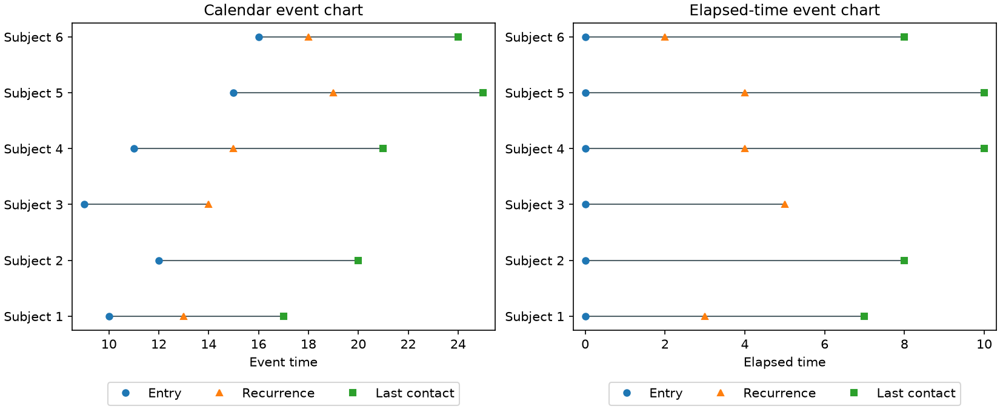
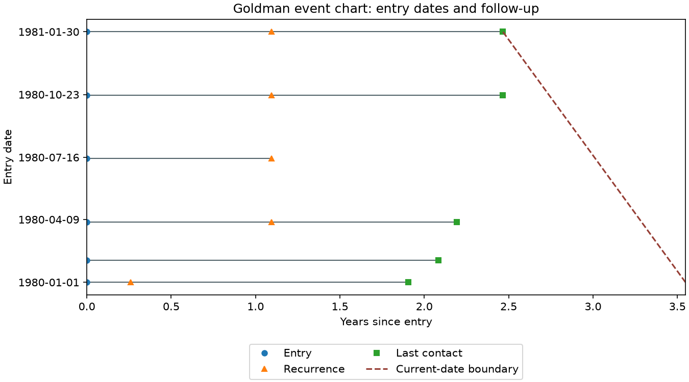
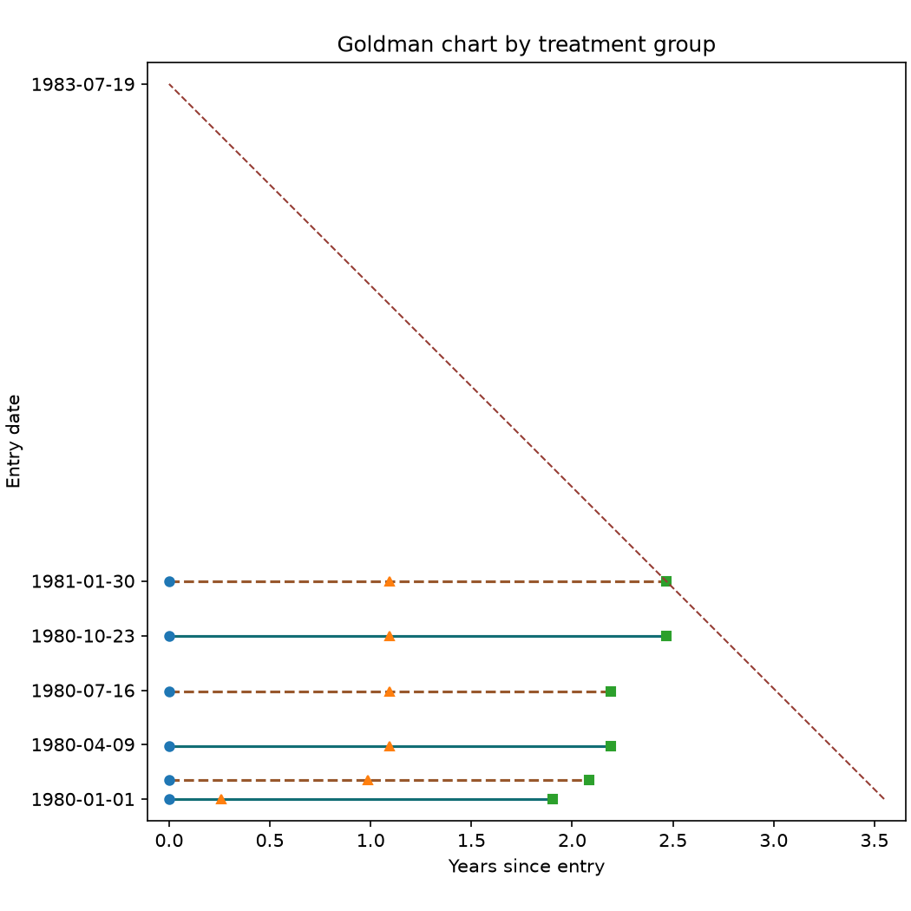
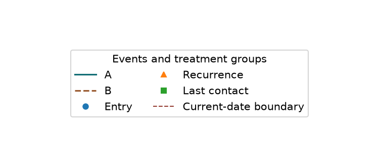

# EVENTCHART: event timelines

`event_convert` expands numeric or categorical time/event-code pairs into one time column per
observed event type. `event_chart_data` prepares calendar or elapsed-time event
charts, and `plot_event_chart` renders them using the optional `plot` extra.

```python
import numpy as np
from mdanderson_stats import event_convert, event_chart_data, plot_event_chart

converted = event_convert([[5, 1], [6, 0], [3, 1], [1, 1], [2, 0]])
times = np.column_stack((np.zeros(5), converted.times))
chart = event_chart_data(times, reference=0)
axes = plot_event_chart(chart, event_labels=("Entry", "Censored", "Death"))
axes.figure.savefig("event-chart.png")
```



## Data and geometry

Chart inputs are numeric matrices with NaN for missing entries. The converter
also accepts mixed matrices with string event codes and None for missing values.
Infinity and complex event times/codes are rejected. Limits are one million rows, 1000 columns and two million
matrix entries; conversion also limits its expanded output and total row/pair
combinations to two million each.
Negative times are allowed, including events before the reference time.
Numerical result arrays are immutable.

`event_convert(data, time_columns=(0,), code_columns=(1,))` uses zero-based column
indices. Supply equal-length index vectors for up to 1000 time/code pairs; repeated
indices allow one time column to be reused with different event codes. Pair
order is retained. Each code column must contain only strings or only numbers,
plus optional None/NaN. Numeric codes sort numerically; strings sort by Unicode
code point, independent of the machine locale. None/NaN codes create no event,
and missing times remain NaN. Empty strings and the literal string "NA" are
valid categories, not missing-value tokens. With no observed or declared codes,
the result has zero event columns. Only selected time/code columns are interpreted;
unselected columns may contain other metadata. `names` optionally supplies names for all input columns;
output names combine the time-column name and code (e.g. `V1.0`, `V1.1`).
`source_columns` and `codes` retain the mapping to each output column. Numeric
category identity is preserved, including distinct integer codes beyond 2**53
when they are supplied as integers (rather than already-rounded floats).

`code_levels` supplies one category sequence or None per time/code pair. Explicit
sequences preserve their order and include unobserved categories as all-missing
columns, matching the original factor input. Categories must be unique, nonmissing
and of the same type as the corresponding code column; every observed code must
be declared. None selects automatic sorting for that pair.

```python
converted = event_convert(
    [[5, "death", "10"], [6, "censored", "2"], [None, "death", "2"]],
    time_columns=(0, 0),
    code_columns=(1, 2),
    names=("time", "cause", "status"),
    code_levels=(("death", "censored", "relapse"), None),
)
# Columns: time.death, time.censored, time.relapse, time.10, time.2
```

This interface does not require pandas. If an input array was already converted
to strings or floats before the call, its original category types cannot be
recovered; a mixed Python list or object array preserves them.

`event_chart_data` accepts these layout options:

- `columns` and `rows`: nonempty, unique zero-based indices, defaulting to all.
- `reference`: original data column subtracted from every event column per row.
  `scale` is a positive divisor, such as 365 for elapsed years. Subtraction and
  division must produce finite coordinates wherever inputs are observed.
- `sort_by`: original data columns, in priority order. `ascending` is a boolean
  or one boolean per key. Sorting is stable; `na_last` explicitly controls missing
  keys in both directions. Sorting and `y_column` cannot be combined.
- `sort_after_subset=True`: first subset, then sort the selected records. When
  false, first sort all records and interpret `rows` as positions in that order.
- `drop_missing`: omit records with no remaining event times, including missing
  reference values. Otherwise they occupy empty rows. `renumber` places retained
  rows consecutively at 1,2,...; otherwise selected positions are retained.
- `y_column`: place records using a numeric covariate; missing covariates are
  omitted. `jitter` is a nonnegative factor multiplying the covariate range /
  `[2*(number of retained rows - 1)]`. A local generator controlled by `seed`
  supplies uniform offsets. Singleton and constant covariates have no jitter.
- `line_pairs`: pairs of selected original columns whose event times define
  extra intervals. At most 100 pairs are supported. Missing endpoints leave gaps.
- `all_rows_range`: use all original records to determine the x range, as in
  the source default; false uses only retained records.
- `labels`: one string per original record, carried through sorting/subsetting.

The result contains `times`, vertical `positions`, rowwise minimum/maximum
`spans`, extra `overlays`, original `rows` and `columns`, retained `labels`, the
`x_range`, whether coordinates are `relative` to a reference, and the `time_scale` divisor. Missing-only
spans are NaN, not infinite pseudo-endpoints. A chart needs at least one retained
row and an observed event in its requested range.

The renderer returns its Axes without showing or saving. It accepts event labels,
marker shapes, span color and x-axis label; extra intervals are dashed. `calendar=True` formats absolute x coordinates as calendar dates, using the
stored `time_scale` to recover days and `date_origin="1960-01-01"` by default.
Calendar formatting is rejected for reference-subtracted elapsed times. Use the returned Axes for styling and additional annotations.

## Dates and Goldman charts

`event_dates(("1980-01-01", "1980-02-01", None))` converts ISO dates or Python
`date` objects into days since `origin="1960-01-01"`; None becomes NaN.
`event_date_labels(day_offsets)` returns ISO date strings, rounding finite day
offsets to the nearest day. An explicit origin must be an ISO date. Conversion
uses the proleptic Gregorian calendar, validates years 1..9999 and handles leap
years without a time zone or an additional date-library dependency. The formatter
uses four-digit ISO years rather than the source's month/day/two-digit-year style.

```python
from mdanderson_stats import goldman_chart_data, plot_goldman_chart

chart = goldman_chart_data(
    [[7305, 7400, 8000], [7340, 7700, 8100], [7600, 8000, 8500]],
    reference=0,
    scale=365,
)
axes = plot_goldman_chart(chart, xlabel="Years since entry")
axes.figure.savefig("goldman-chart.png")
```



`goldman_chart_data` places subjects at their reference-column calendar dates and
plots their elapsed event times horizontally. It accepts selected `columns` and
`rows`, positive `scale`, missing-row removal and interval `line_pairs`.
`now` is an explicit calendar day; by default it is the largest observed event
date over the selected columns in all original rows, matching the source.
The result wraps the ordinary immutable `chart` geometry plus a two-endpoint
`boundary`, `now`, and the `native_boundary` flag.

The default boundary is the calendar identity
`elapsed = (now - entry_date) / scale`, evaluated at the retained entry-date
extrema. It is unchanged by other subjects being included or omitted. The source
instead computes a slope from global event minima, minimum elapsed time and the
retained minimum entry date. These rules agree in the standard full-cohort setup,
but can disagree when subsetting or when earlier events precede the reference.
Set `native_boundary=True` to reproduce that source intercept/slope exactly.
A zero source denominator or an unrepresentable boundary raises an error.
The current-date boundary is an annotation, not a filter: events after a supplied
`now` remain visible.

`plot_goldman_chart` draws the current-date boundary as a dashed line and formats
five calendar y ticks using `origin`; `calendar_labels=False` uses numeric ticks.
Event labels, existing Axes and the x-axis label are configurable. Limits include
both observed events and the boundary. Square and legend controls are described below.

The additional native fixture uses synthetic calendar records with missing
events. It compares original event coordinates and the original boundary slope
for both a full cohort and a subset. The numerical statements in `event.chart`
were unchanged; graphics callbacks captured the result. Separate checks cover
the corrected boundary identity, leap-day/date round trips, scaled calendar ticks
and both Goldman/calendar rendering. Source example patient records are not
redistributed.

## Covariate groups and display controls

```python
from mdanderson_stats import (
    EventLineStyle,
    event_chart_data,
    event_chart_legend,
    plot_event_chart,
)

chart = event_chart_data([[0, 5], [0, 6], [0, 3], [0, 1], [0, 2]], reference=0)
axes = plot_event_chart(
    chart,
    line_groups=("A", "B", "A", "B", "A"),
    group_styles={
        "A": EventLineStyle("teal", "-", 1.5),
        "B": EventLineStyle("brown", "--", 1.5),
    },
    legend=False,
)
legend_page = event_chart_legend(axes, title="Events and treatment groups", columns=2)
legend_page.savefig("event-legend.png")
```

`line_groups` contains one numeric or string category per original record; the
renderer applies the chart's retained-row mapping. All nonmissing categories must
be homogeneous numbers or strings. None/NaN, empty strings and the literal "NA"
suppress the subject span, following the source grouping convention. These values
do not suppress event markers or extra interval layers. Automatic styles vary
color and line type; `group_styles` explicitly maps every retained category to an
`EventLineStyle(color, linestyle, linewidth)`.

`overlay_styles` gives one style per `line_pairs` interval. `point_colors` and
`point_sizes` give one value per event column; repeated values are permitted.
Widths/sizes must be finite and nonnegative. `legend=False` omits the internal
legend, while `legend_location` selects a standard Matplotlib location or explicit
axes-relative coordinate pair. The separate `event_chart_legend` figure uses the
actual event and group artists, so its appearance agrees with the chart.

`calendar_y=True` formats arbitrary numeric y covariates as calendar dates using
`date_origin`. `ylabel` supplies the axis title. A general calendar-covariate
boundary is also supported by `goldman_chart_data(y_column=..., native_boundary=True)`;
when the y covariate differs from the reference date there is no universal
calendar-identity line, so the original range-dependent rule must be requested.
`GoldmanChart.entry_axis` reports whether the calendar covariate is the reference.

`plot_goldman_chart` also accepts grouped lines, legend controls and a
`boundary_style`. `square=True` makes the physical axes box square, extends the
calendar view to `now`, and extends the boundary to its current-date intercept.
The current date is labelled and small margins preserve endpoint markers.





The source's grouped-line coordinates, types and widths were checked after
sorting and subsetting. Another native fixture checks the boundary with a
calendar covariate distinct from the elapsed-time reference. Rendering checks
cover missing groups, calendar covariates, custom event/interval appearance,
square layout and a separate legend page.

## Native validation and deliberate corrections

The downloaded S `event.chart` routine was translated only from underscore to R
assignment syntax. Graphics callbacks captured its line and point coordinates.
The fixture compares calendar charts, reference-subtracted/scaled interval charts,
and multi-key sorted subsets with renumbering. The original `event.convert`
function ran unchanged for two time/code pairs with five output event columns.
A second unchanged-source fixture checks string codes, explicit factor order,
an unobserved factor level, and reuse of one time column for two code columns.
Python additionally checks missing codes and exact large-integer category identity.
Focused tests also cover missing references, aligned interval overlays, source-row
provenance, absent codes, deterministic jitter, overflow rejection and rendering.

Corrections to the original implementation:

- Subsetting before sorting can create missing y positions in the source because
  it indexes a shortened row-number vector with original row indices. Python
  retains the selected positions explicitly, including positions beyond the
  subset's length.
- After dropping missing references, the source may renumber even when renumbering
  is disabled. Python preserves the selected positions unless requested otherwise.
- Extra source intervals index unfiltered event rows after missing rows are
  removed. Python applies the same retained-row mapping to every geometry layer.
- Missing codes use an explicit mask, avoiding the source's NA replacement-index
  problem. Empty groups and singleton jitter do not invoke invalid ranges.
- Descending sorting keeps the requested missing-key placement. NumPy jitter is
  reproducible but does not reproduce S random numbers.

**Coverage:** all advertised conversion and plot families are implemented. See
[the source coverage audit](eventchart-coverage.md) for the mapping of calculation,
layout and legend features, plus deliberate differences from the S interface.

Source: [MD Anderson EVENTCHART](https://biostatistics.mdanderson.org/SoftwareDownload/SingleSoftware/Index/32),
[original archive](https://biostatistics.mdanderson.org/SoftwareDownload/SoftwareFiles/EVENTCHART/EVENTCHART_V1.tar.gz).
Lee JJ, Hess KR, Dubin JA, “Extensions and applications of event charts,”
The American Statistician 54:63–70 (2000). Source hashes: `eventchart-sources.json`.
