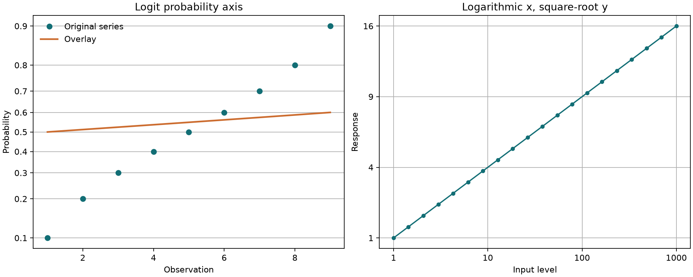

# TRAX: transformed plotting axes

TRAX plots arbitrary pointwise transformations of x, y, or both, labeling ticks
in the original measurement units. It includes points, lines, grids, limits and
overlays. Install the package's `plot` extra to draw figures; `trax_data` requires
only the core dependencies.

```python
import numpy as np
from mdanderson_stats import trax


def logit(p):
    return np.log(p / (1 - p))


x = np.arange(1, 10)
p = x / 10
plot = trax(x, p, yfunc=logit, yticks=p, ygrid=True, ylabel="Probability")
added = plot.add(x, np.linspace(0.5, 0.6, 9), color="orange")
assert np.allclose(added.y, logit(np.linspace(0.5, 0.6, 9)))
plot.axes.figure.savefig("trax-example.png")
```



`xfunc` and `yfunc` default to identity. Callbacks receive read-only float64
vectors and must return same-shaped real vectors, applying the same pointwise
function regardless of vector length. They are also called on tick values and
limit endpoints. Callback exceptions propagate. Choose transformations that
provide meaningful axes over the plotted domain; monotonicity is the caller's
responsibility. Overlapping transformed tick positions are rejected.

`xticks`, `yticks`, `xlim` and `ylim` use **original units**. Limits must have two
distinct endpoints whose transformed values are finite and distinct; endpoint
order is preserved. Automatic ticks are selected within the retained original
data range (or explicit limits), using `xnint` and `ynint` as approximate interval
requests in 2..100. Explicit ticks provide exact control over placement.
`xgrid` and `ygrid` independently enable grid lines.

`kind="points"`, `"line"` or `"both"` controls the initial series. Other plotting
keywords are Matplotlib line/marker properties. Supply `axes=` to use an existing
linear-scale Axes. The returned `TRAXPlot` exposes `.axes` and a tuple of `.series`;
`.add(...)` defaults to lines, reuses the initial transformations and filtering
policy, and preserves view limits and tick labels. Data outside those limits
remain clipped. Saving or showing the figure is the caller's responsibility.

`trax_data(x, y, ...)` exposes immutable original/transformed pairs without
importing Matplotlib. It accepts 2..1,000,000 paired observations and requires at
least two jointly finite results. With default `invalid="drop"`, a pair is removed
if either raw or transformed coordinate is nonfinite. `retained_indices` and
`dropped_indices` refer to original zero-based row indices. Use `invalid="raise"`
to reject any such observation. Finite transformations that exceed float64 range
therefore follow this same explicit policy.

## Source comparison and corrections

The original S function was run under R 4.4.1 with an `is.inf <- is.infinite`
compatibility alias and graphics wrappers that recorded coordinates while
calling the real graphics functions. Its nine-point logit example and nine-point
overlay agree with this port within relative 1e-13 / absolute 1e-14 tolerance.
The tick rendering check verifies the example's original-unit labels and logit
positions, and confirms that adding a series preserves the existing limits.
The accompanying figure was rendered and visually inspected.

The original code globally changes warning options and has filtering branches
that can misalign original/transformed x values after infinite results. This port
uses local floating-point warning control and a joint paired mask. It also
replaces the source's iterative invalid-endpoint tick adjustment with finite
in-domain tick selection. Automatic tick choices and styling need not match
S's `pretty`/graphics output exactly. The coverage designation refers to the
advertised transformed-axis plotting functionality, including overlays.

Sources: [MD Anderson TRAX](https://biostatistics.mdanderson.org/SoftwareDownload/SingleSoftware/Index/60)
and [original archive](https://biostatistics.mdanderson.org/SoftwareDownload/SoftwareFiles/TRAX/TRAX_V1.tar.gz).
Source hashes are in `trax-sources.json`; original code remains in ignored
research storage and is not redistributed.
